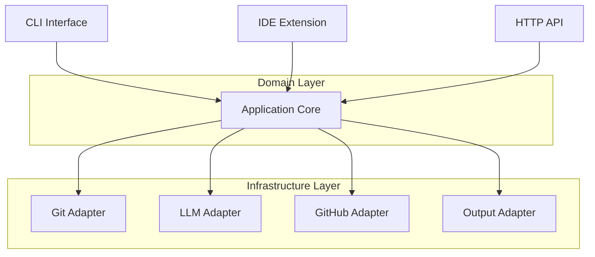

---
navigation:
  icon: i-lucide-folder-tree
title: Project Structure
description: Learn about the architecture and project structure of AI Developer Assistant.
---

## Architecture Overview

AI Developer Assistant follows **Hexagonal Architecture** (Ports & Adapters) principles, providing a clean, modular, and extensible design that separates business logic from external dependencies.



## Project Structure

When you clone the AI Developer Assistant repository, you get:

```bash
ai-developer-assistant/
├── src/                     # Source code
│   ├── domain/             # Core business logic
│   │   ├── entities/       # Domain entities
│   │   ├── ports/          # Interface definitions
│   │   └── usecases/       # Business use cases
│   ├── adapters/           # External integrations
│   │   ├── inbound/        # CLI, API adapters
│   │   └── outbound/       # Git, LLM, GitHub adapters
│   ├── config/             # Configuration management
│   └── utils/              # Utility functions
├── tests/                  # Test files
├── docs/                   # Documentation
├── ai-dev.config.yaml      # Configuration template
├── package.json            # Dependencies and scripts
└── README.md               # Project documentation
```

### `src/domain/` - Core Business Logic

This directory contains the heart of the application - the domain layer that implements business rules and use cases:

```bash
src/domain/
├── entities/               # Domain entities
│   ├── Diff.ts            # Git diff representation
│   ├── ReviewComment.ts   # Code review feedback
│   ├── ReviewReport.ts    # Complete review report
│   ├── CodeBlock.ts       # Code block analysis
│   ├── TestSuggestion.ts  # Test generation suggestions
│   ├── SecurityIssue.ts   # Security vulnerability
│   └── DocSuggestion.ts   # Documentation suggestions
├── ports/                  # Interface definitions
│   ├── DiffProviderPort.ts     # Git integration interface
│   ├── LLMPort.ts             # AI model interface
│   ├── OutputPort.ts          # Output formatting interface
│   ├── GitHubPort.ts          # GitHub integration interface
│   └── ConfigPort.ts          # Configuration interface
└── usecases/               # Business use cases
    ├── ReviewCodeUseCase.ts    # Code review logic
    ├── ExplainCodeUseCase.ts   # Code explanation logic
    ├── GenerateCommitMsgUseCase.ts # Commit message generation
    ├── GenerateTestsUseCase.ts     # Test generation logic
    ├── SecurityScanUseCase.ts      # Security scanning logic
    └── GenerateDocsUseCase.ts      # Documentation generation
```

### `src/adapters/` - External Integrations

This directory contains adapters that implement the ports defined in the domain layer:

```bash
src/adapters/
├── inbound/                # Input adapters
│   ├── CLI/               # Command-line interface
│   │   ├── Commands/      # CLI commands
│   │   └── CLIAdapter.ts  # CLI implementation
│   ├── API/               # HTTP API (future)
│   └── IDE/               # IDE extensions (future)
└── outbound/              # Output adapters
    ├── Git/               # Git integration
    │   └── GitAdapter.ts  # Git operations
    ├── LLM/               # AI model integrations
    │   ├── OpenAIAdapter.ts    # OpenAI integration
    │   ├── OllamaAdapter.ts    # Ollama integration
    │   └── GeminiAdapter.ts    # Google Gemini integration
    ├── GitHub/            # GitHub integration
    │   └── GitHubAdapter.ts    # GitHub API operations
    └── Output/            # Output formatting
        ├── ConsoleAdapter.ts   # Console output
        ├── MarkdownAdapter.ts  # Markdown output
        └── JSONAdapter.ts      # JSON output
```

### Configuration Files

```bash
ai-developer-assistant/
├── ai-dev.config.yaml      # Default configuration
├── ai-dev.config.local.yaml # Local overrides (gitignored)
├── .env                    # Environment variables
├── .env.example           # Environment template
└── package.json           # Dependencies and scripts
```

#### `ai-dev.config.yaml` - Default Configuration

```yaml
llm:
  provider: "gemini"          # Default LLM provider
  model: "gemini-2.0-flash"   # Default model
  temperature: 0.7            # AI creativity level
  maxTokens: 2000            # Maximum response length

gemini:
  apiKey: "${GEMINI_API_KEY}" # Environment variable
  model: "gemini-2.0-flash"

output:
  format: "console"           # Default output format
  colorize: true             # Enable colored output
  verbose: false             # Detailed logging

security:
  enabled: true              # Enable security scanning
  severity: ["medium", "high", "critical"]
```

#### `package.json` - Dependencies

```json
{
  "name": "kg6-codex",
  "version": "1.0.0",
  "description": "AI Developer Assistant",
  "bin": {
    "ai-dev": "./dist/cli.js"
  },
  "scripts": {
    "build": "tsc",
    "dev": "ts-node src/adapters/inbound/CLI/CLIAdapter.ts",
    "test": "jest"
  },
  "dependencies": {
    "@types/node": "^20.0.0",
    "commander": "^11.0.0",
    "openai": "^4.0.0",
    "simple-git": "^3.0.0"
  }
}
```

## Extensibility

### Custom Adapters

You can create custom adapters by implementing the domain ports:

```typescript
// Custom LLM Provider
export class CustomLLMProvider implements LLMProvider {
  async generateResponse(messages: LLMMessage[]): Promise<LLMResponse> {
    // Your custom implementation
  }
}

// Custom Output Format
export class CustomOutputAdapter implements OutputPort {
  async displayReviewReport(report: ReviewReport): Promise<void> {
    // Your custom output logic
  }
}
```

### Plugin System

```typescript
// Register custom adapters
const llmAdapter = new LLMAdapter(config);
llmAdapter.registerProvider('custom', new CustomLLMProvider());

const outputAdapter = new OutputAdapter();
outputAdapter.registerFormat('custom', new CustomOutputAdapter());
```

::prose-tip
This modular architecture allows you to extend AI Developer Assistant with custom integrations while maintaining clean separation of concerns.
::

## Key Benefits

- **Clean Architecture**: Separates business logic from infrastructure concerns
- **Extensible**: Easy to add new LLM providers, output formats, or integrations
- **Testable**: Domain logic can be tested independently of external dependencies
- **Technology Agnostic**: Core logic doesn't depend on specific technologies
- **Maintainable**: Clear boundaries make the codebase easy to understand and modify